# Vietnam Financial Dashboard

Dashboard nghiên cứu tài chính và chứng khoán Việt Nam, tập trung vào dữ liệu vĩ mô, phân tích thị trường, định giá doanh nghiệp, dự báo, quản trị rủi ro và nhật ký giao dịch.

Repo này là bản giới thiệu công khai: chỉ có README, tài liệu mô tả và hình ảnh màn hình. Source code backend/frontend, dữ liệu cá nhân, file `.env`, database, model params nội bộ và file chạy thật không nằm trong repo này.

## Mục Lục

- [Tổng Quan Sản Phẩm](#tổng-quan-sản-phẩm)
- [Vĩ Mô Việt Nam](#vĩ-mô-việt-nam)
- [Phân Tích Thị Trường](#phân-tích-thị-trường)
- [Ngành Và Danh Mục](#ngành-và-danh-mục)
- [Mô Hình Định Giá](#mô-hình-định-giá)
- [Nhật Ký Giao Dịch](#nhật-ký-giao-dịch)
- [Tài Liệu Kèm Theo](#tài-liệu-kèm-theo)
- [Bảo Mật](#bảo-mật)

## Tổng Quan Sản Phẩm

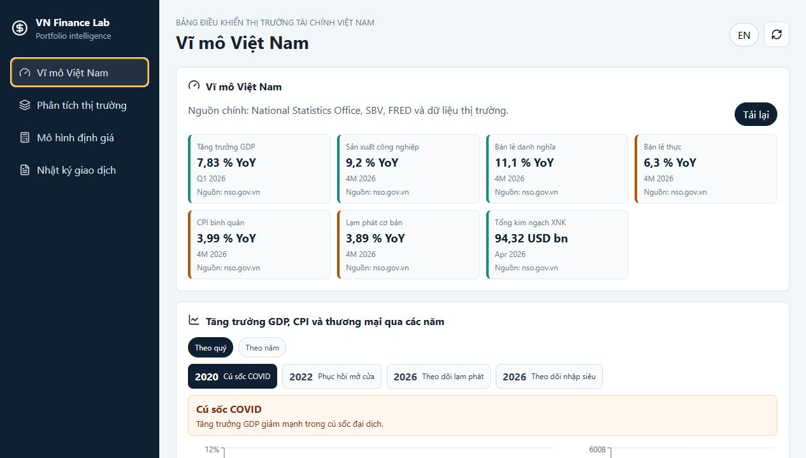

Ảnh trên là màn hình vĩ mô sau khi dữ liệu đã tải xong, thể hiện các chỉ báo lớn như GDP, CPI, thương mại, tỷ giá, lãi suất và vùng cảnh báo thị trường.

VN Finance Lab được thiết kế như một dashboard ra quyết định đầu tư theo quy trình:

```text
Chu kỳ ngành -> Định giá -> CAPM/Beta -> PTKT -> Markowitz -> Dự báo -> Rủi ro -> Quyết định -> Nhật ký giao dịch
```

Mục tiêu không phải tạo một tín hiệu mua/bán duy nhất, mà gom nhiều lớp bằng chứng để người dùng hiểu:

- Thị trường và vĩ mô đang ở trạng thái nào.
- Ngành nào đang có bối cảnh tốt hơn.
- Cổ phiếu có định giá hợp lý không.
- Rủi ro danh mục và từng cổ phiếu có vượt mức chịu đựng không.
- Dự báo/model có đáng tin ở giai đoạn kiểm định không.
- Quyết định đầu tư đã được ghi lại và học lại sau đó chưa.

## Vĩ Mô Việt Nam

Mục vĩ mô là màn hình mở đầu để người dùng nhìn bức tranh lớn trước khi đi vào cổ phiếu.

Các phần chính:

- Chỉ báo kinh tế: GDP, CPI, thương mại, tỷ giá, lãi suất và các biến vĩ mô quan trọng.
- Dòng tiền nước ngoài: theo dõi mua/bán ròng, giá trị giao dịch và nhóm mã được chú ý.
- FRED T10Y3M: theo dõi chênh lệch lợi suất Mỹ 10 năm - 3 tháng để tham khảo rủi ro suy thoái toàn cầu.
- Xuất nhập khẩu: cơ cấu theo nhóm ngành, giúp liên hệ với các ngành hưởng lợi hoặc chịu áp lực.
- Histogram theo ngành: xem phân phối giá và dao động của cổ phiếu trong từng ngành.

Cách dùng:

- Nếu vĩ mô ổn định và dòng tiền cải thiện, có thể tăng mức ưu tiên cho các tín hiệu ngành/cổ phiếu.
- Nếu tín hiệu suy thoái, lãi suất, tỷ giá hoặc dòng tiền nước ngoài xấu đi, nên giảm mức tin cậy của forecast và tăng trọng số kiểm tra rủi ro.
- Dữ liệu macro thường có độ trễ, vì vậy nên dùng để đánh giá bối cảnh, không dùng như tín hiệu giao dịch tức thời.

## Phân Tích Thị Trường

Đây là khu vực gom các công cụ phân tích chính của dashboard.

### Bảng Điện

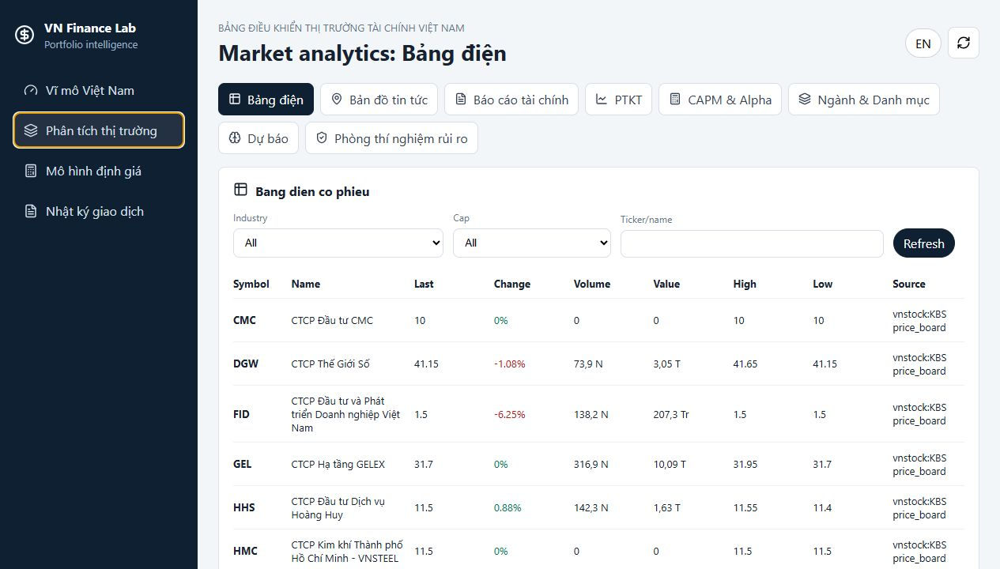

Mục bảng điện dùng để quan sát nhanh cổ phiếu:

- Giá gần nhất, thay đổi giá, phần trăm thay đổi.
- Khối lượng và giá trị giao dịch.
- Sàn giao dịch, ngành, nhóm vốn hóa.
- Bộ lọc theo ngành, vốn hóa và mã.

Ý nghĩa:

- Giúp người dùng tìm nhanh các mã đang được thị trường chú ý.
- Là điểm bắt đầu trước khi đi sâu sang báo cáo tài chính, kỹ thuật hoặc định giá.
- Hình trên minh họa bảng lọc theo ngành, vốn hóa và mã; phần bảng phía dưới hiển thị giá, thay đổi, thanh khoản và nguồn dữ liệu.

### Bản Đồ Tin Tức

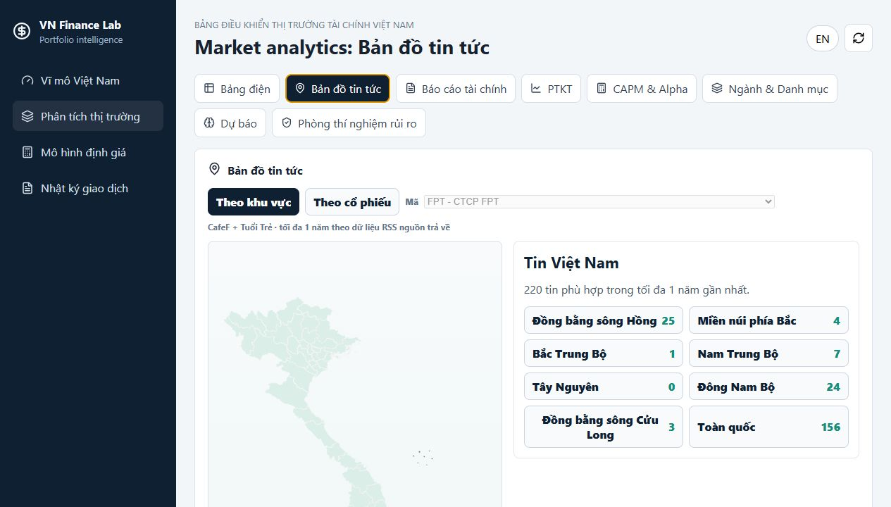

Bản đồ tin tức hiển thị tin kinh tế, chính sách và thị trường theo khu vực hoặc theo mã cổ phiếu.

Các lớp thông tin:

- Bản đồ Việt Nam.
- Lớp Phú Quốc, Hoàng Sa, Trường Sa dạng visual/inset.
- Tin tức theo vị trí hoặc theo ticker.
- Popup/tên khu vực khi rê chuột.

Ý nghĩa:

- Giúp nối tin tức với địa phương, ngành hoặc doanh nghiệp liên quan.
- Hữu ích khi cần xem một sự kiện chính sách/vĩ mô có thể ảnh hưởng tới nhóm cổ phiếu nào.
- Hình trên thể hiện màn hình bản đồ/tin tức sau khi dữ liệu đã tải, dùng để theo dõi tin theo vị trí hoặc theo mã cổ phiếu.

### Báo Cáo Tài Chính

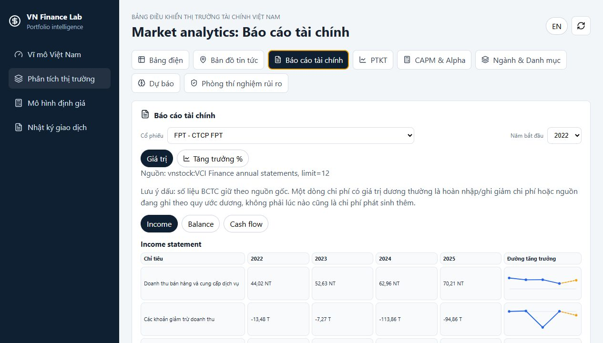

Mục báo cáo tài chính dùng để đọc dữ liệu nền của doanh nghiệp:

- Doanh thu, lợi nhuận, biên lợi nhuận.
- Tài sản, nợ, vốn chủ.
- Dòng tiền và các chỉ tiêu liên quan.
- Nguồn dữ liệu và cảnh báo khi dữ liệu thiếu.

Ý nghĩa:

- Là lớp kiểm tra chất lượng doanh nghiệp trước khi dùng định giá.
- Giúp đọc nhanh xu hướng doanh thu, lợi nhuận, biên lợi nhuận, tài sản, nợ và dòng tiền qua các kỳ.
- Hình trên minh họa khu vực chọn cổ phiếu và đọc báo cáo tài chính, nơi người dùng kiểm tra dữ liệu nền của doanh nghiệp.

### PTKT

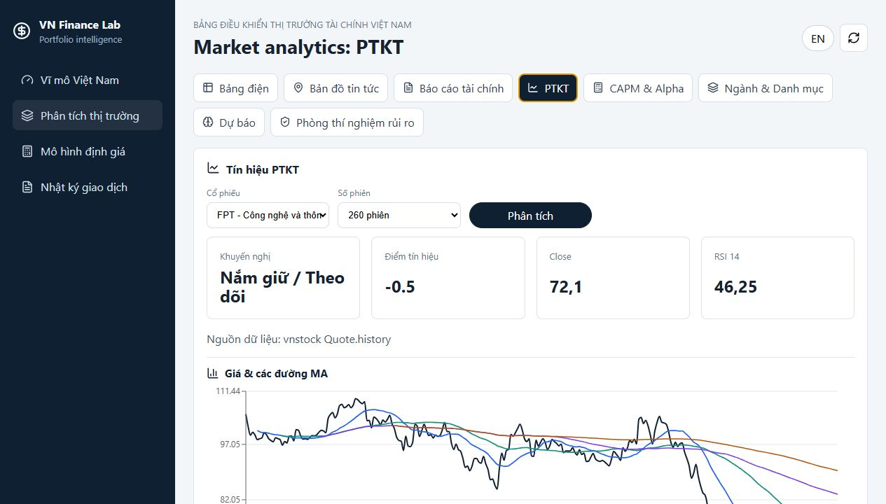

Phân tích kỹ thuật dùng để kiểm tra trạng thái giá và dòng tiền:

- MA trend: MA20, MA50, MA100, MA200.
- MACD: động lượng xu hướng.
- RSI: quá mua/quá bán.
- Volume: dòng tiền và mức xác nhận.
- Bảng “PTKT tốt theo ngành” để quét các mã nổi bật trong từng ngành.

Ý nghĩa:

- Không thay thế định giá, nhưng giúp chọn thời điểm quan sát hoặc hành động.
- Nếu định giá tốt nhưng kỹ thuật xấu, có thể đưa vào danh sách theo dõi thay vì mua ngay.
- Hình trên minh họa màn hình PTKT với lựa chọn cổ phiếu/ngành và các khối tín hiệu kỹ thuật phục vụ lọc mã.

### CAPM Và Alpha

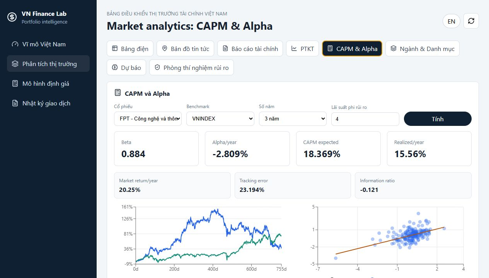

CAPM/Beta dùng để xem quan hệ giữa cổ phiếu và benchmark:

- Beta: độ nhạy của cổ phiếu với thị trường.
- Alpha: phần vượt/kém so với kỳ vọng CAPM.
- Expected return: lợi suất kỳ vọng theo mô hình.
- Scatter chart: quan hệ lợi suất cổ phiếu và thị trường.

Ý nghĩa:

- Beta cao phù hợp người chịu biến động cao hơn.
- Beta thấp phù hợp mục tiêu phòng thủ hơn.
- Alpha dương là tín hiệu đáng xem, nhưng cần kiểm tra thêm valuation, kỹ thuật và rủi ro.
- Hình trên minh họa phần tính beta/alpha và biểu đồ quan hệ giữa lợi suất cổ phiếu với benchmark.

### Dự Báo

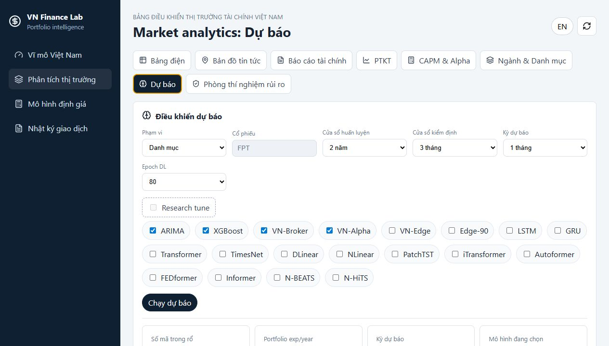

Mục dự báo cho phép chạy và so sánh nhiều model:

- ARIMA/AutoARIMA.
- XGBoost.
- VN-Edge, Edge-90 và các biến thể directional.
- Deep learning như LSTM, GRU, Transformer, TimesNet, DLinear, NLinear, PatchTST, iTransformer, Autoformer, FEDformer, Informer, N-BEATS, N-HiTS nếu môi trường đủ thư viện.

Các chỉ số cần đọc:

- Đúng toàn test: độ chính xác hướng trên toàn giai đoạn kiểm định.
- Đúng trên tín hiệu: độ chính xác khi model có tín hiệu rõ.
- Độ phủ: tỷ lệ điểm có tín hiệu.
- RMSE/MAE: sai số theo thang giá thật.

Ý nghĩa:

- Model nào có RMSE thấp nhưng sai hướng nhiều thì phù hợp tham khảo mức giá hơn là tín hiệu giao dịch.
- Model nào đúng hướng cao nhưng độ phủ thấp thì chỉ nên coi là tín hiệu chọn lọc.
- Hình trên minh họa màn hình điều khiển dự báo: chọn phạm vi, cửa sổ train/test, horizon, epoch và model cần chạy.

### Phòng Thí Nghiệm Rủi Ro

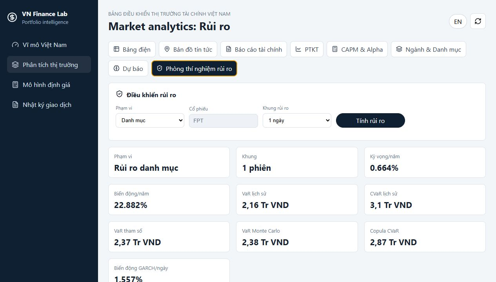

Mục rủi ro giúp trả lời câu hỏi: “Nếu sai thì có thể mất bao nhiêu?”.

Các phần chính:

- Historical VaR/CVaR.
- Parametric VaR.
- Monte Carlo VaR.
- GARCH volatility proxy.
- Component VaR theo mã.
- Copula tail model cho danh mục nhiều tài sản.

Ghi chú quan trọng:

- Với một cổ phiếu riêng lẻ, copula không cần thiết vì copula chủ yếu dùng để mô phỏng phụ thuộc giữa nhiều tài sản.
- Với danh mục nhiều cổ phiếu, copula giúp xem rủi ro giảm đồng thời và phụ thuộc đuôi.
- Hình trên minh họa nơi chọn phạm vi rủi ro, mã cổ phiếu/danh mục, khung thời gian và ngân sách để tính VaR/CVaR.

## Ngành Và Danh Mục

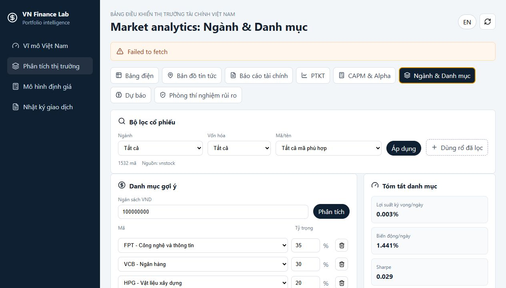

Ảnh trên minh họa khu vực phân tích ngành và danh mục, nơi người dùng lọc cổ phiếu, chọn tỷ trọng, xem chỉ số danh mục và chạy các mô phỏng phân bổ.

Đây là phần kết nối giữa phân tích ngành và xây dựng danh mục.

### Bộ Lọc Cổ Phiếu

Cho phép lọc universe theo:

- Ngành.
- Vốn hóa.
- Mã/tên cổ phiếu.
- Nguồn dữ liệu.

Ý nghĩa:

- Giúp tạo rổ cổ phiếu ban đầu thay vì chọn mã thủ công.
- Rổ đã lọc có thể được đưa vào danh mục để phân bổ tỷ trọng.

### Danh Mục Gợi Ý

Người dùng có thể:

- Chọn mã cổ phiếu.
- Nhập tỷ trọng.
- Nhập ngân sách VND.
- Thêm/xóa mã trong danh mục.
- Bấm phân tích để tính lại kết quả.

Ý nghĩa:

- Biến danh sách cổ phiếu thành một danh mục có trọng số thật.
- Là đầu vào cho Markowitz, risk contribution và forecast danh mục.

### Tóm Tắt Danh Mục

Các chỉ số chính:

- Lợi suất kỳ vọng/ngày.
- Biến động/ngày.
- Sharpe.
- Lợi suất kỳ vọng/năm.
- Biến động/năm.
- Risk contribution theo từng mã.

Ý nghĩa:

- Nếu một mã đóng góp rủi ro quá lớn, cần giảm tỷ trọng dù kỳ vọng lợi suất hấp dẫn.
- Sharpe cao hơn không luôn tốt hơn nếu danh mục quá tập trung.

### Histogram Lãi/Lỗ Theo Tỷ Trọng

Biểu đồ histogram mô phỏng phân phối lãi/lỗ của danh mục theo lịch sử:

- Số phiên thực tế.
- Tỷ lệ phiên lãi.
- Lãi/lỗ trung vị.
- Đuôi 5%.
- Skewness và kurtosis.

Ý nghĩa:

- Giúp xem danh mục có nhiều ngày lỗ lớn hiếm gặp không.
- Đuôi 5% là vùng cần chú ý khi quản trị vốn.

### Chu Kỳ Fourier Theo Ngành

Phân tích ngành bằng chu kỳ:

- Xu hướng.
- Lợi suất làm mượt.
- Chu kỳ Fourier.
- Phần dư.
- Chu kỳ trội theo số phiên.

Ý nghĩa:

- Tìm ngành có pha chu kỳ cải thiện.
- Không dùng như lệnh mua trực tiếp, mà dùng để ưu tiên ngành cần nghiên cứu.

### Mô Phỏng Markowitz

Mục này mô phỏng nhiều tỷ trọng danh mục để tìm:

- Danh mục Sharpe cao nhất.
- Danh mục biến động thấp nhất.
- Scatter risk/return của các tỷ trọng ngẫu nhiên.
- Tỷ trọng tối ưu theo mô phỏng.

Ý nghĩa:

- Giúp người dùng tránh phân bổ cảm tính.
- Nếu Markowitz gợi ý tỷ trọng quá lệch vào một mã, cần áp thêm kỷ luật giới hạn tỷ trọng.

### Ma Trận Tương Quan

Heatmap tương quan cho biết các mã đi cùng nhau ra sao:

- Tương quan cao: rủi ro tập trung cao hơn.
- Tương quan thấp hoặc âm: có thể giúp đa dạng hóa.

Ý nghĩa:

- Danh mục nhiều mã nhưng cùng ngành/tương quan cao vẫn có thể không đa dạng hóa thật.

## Mô Hình Định Giá

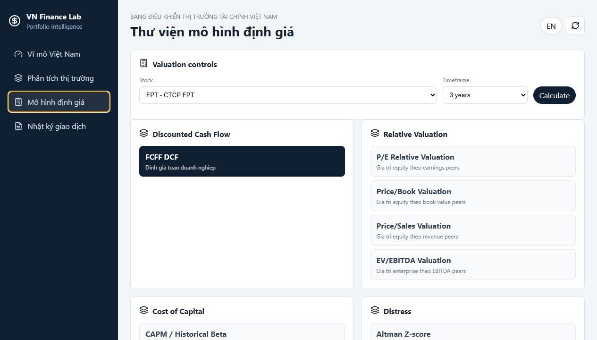

Ảnh trên minh họa thư viện định giá với các mô hình FCFF DCF và relative valuation, kèm khu vực chỉnh giả định đầu vào trước khi tính lại.

Thư viện định giá giúp kiểm tra giá hợp lý của doanh nghiệp.

### FCFF DCF

Mô hình chiết khấu dòng tiền tự do cho doanh nghiệp:

- Dự phóng doanh thu.
- Biên EBIT.
- Thuế.
- Khấu hao.
- Capex.
- Nhu cầu vốn lưu động.
- WACC và terminal growth.

Ý nghĩa:

- Hữu ích với doanh nghiệp có dòng tiền tương đối ổn định.
- Rất nhạy với giả định tăng trưởng, WACC và biên lợi nhuận.

### Relative Valuation

Các mô hình so sánh peer:

- P/E Relative Valuation.
- Price/Book Valuation.
- Price/Sales Valuation.
- EV/EBITDA nếu đủ dữ liệu.

Ý nghĩa:

- Cho biết thị trường đang định giá cổ phiếu so với nhóm cùng ngành ra sao.
- `Peers used` là số peer qua bộ lọc hợp lệ, không phải tổng số peer đã thử quét.

### Edit Inputs

Người dùng có thể chỉnh các input numeric trước khi tính lại:

- Khi dữ liệu crawl thiếu.
- Khi đơn vị dữ liệu cần điều chỉnh.
- Khi muốn chạy kịch bản bảo thủ/cơ sở/tích cực.

Ý nghĩa:

- Giúp biến định giá thành công cụ nghiên cứu có giả định rõ ràng, không phải “hộp đen”.

## Nhật Ký Giao Dịch

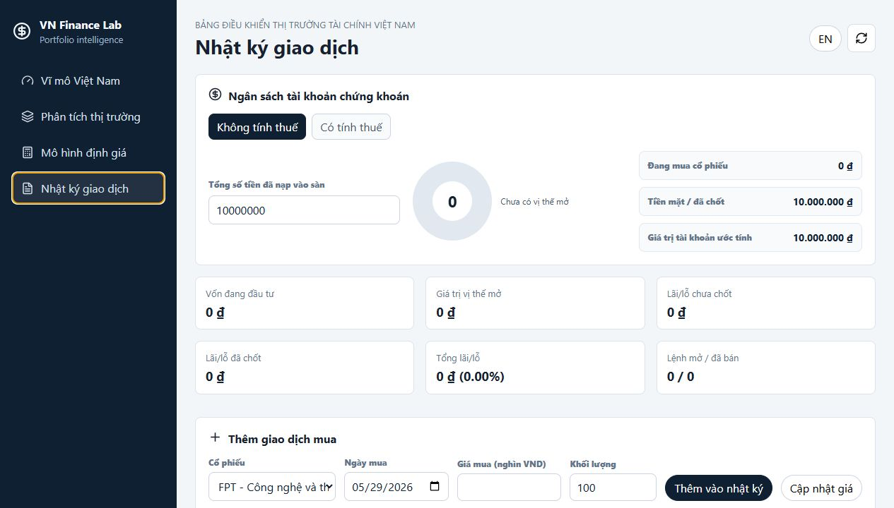

Ảnh trên minh họa màn hình nhật ký giao dịch, dùng để ghi lại lệnh mua/bán, trạng thái vị thế và kết quả lãi/lỗ.

Nhật ký giao dịch giúp ghi lại quá trình ra quyết định và kết quả thực tế.

Các thông tin chính:

- Mã cổ phiếu.
- Ngày mua.
- Giá mua.
- Khối lượng.
- Trạng thái mở/đã bán.
- Giá trị hiện tại.
- Lãi/lỗ.
- Thuế/phí nếu có.

Ý nghĩa:

- Giúp người dùng học lại quyết định đúng/sai.
- Kết nối thesis ban đầu với kết quả thật.
- Tránh việc chỉ nhớ các lệnh thắng và quên các lệnh sai.

## Tài Liệu Kèm Theo

Các tài liệu được copy từ project chính sang dạng đọc tham khảo trong thư mục `project-docs/`. Đây là tài liệu Markdown và hình minh họa, không phải source code chạy app.

- [Project README](project-docs/README.md): mô tả project đầy đủ, cách chạy local/public, module, nguồn dữ liệu và cảnh báo vận hành.
- [Read index](project-docs/read.md): danh mục tài liệu quan trọng.
- [Workflow đầu tư](project-docs/docs/dashboard_workflow_vi.md): quy trình sử dụng dashboard để ra quyết định đầu tư.
- [Software stack](project-docs/docs/software_stack_vi.md): kiến trúc, frontend, backend, nguồn dữ liệu và luồng API.
- [Forecast models](project-docs/docs/forecast_models_vi.md): giải thích các model dự báo, train/test, metric và tham số.
- [Deploy README](project-docs/deploy/README_DEPLOY.md): mô tả cách triển khai production lên VPS/domain.
- [ACTION plan](project-docs/ACTION.md): roadmap phát triển.
- [MONITORING plan](project-docs/MONITORING.md): kế hoạch monitoring dữ liệu, model và rủi ro.

## Bảo Mật

Repo showcase này chỉ chứa:

- `README.md`.
- Ảnh chụp màn hình trong `assets/`.
- Tài liệu Markdown trong `project-docs/`.
- SVG minh họa trong `project-docs/docs/assets/`.

Repo này không chứa:

- Source code backend/frontend thật.
- File `.env`.
- Database.
- Dữ liệu giao dịch cá nhân.
- File cache/model params nội bộ.
- Công cụ tunnel hoặc binary chạy local.

Source code đầy đủ của sản phẩm vẫn nằm trong repo riêng tư.
