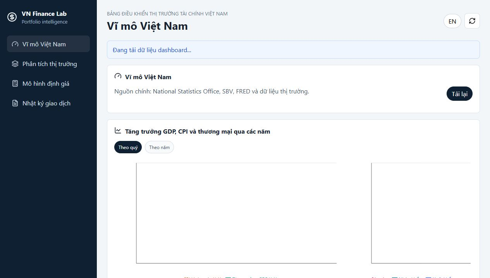
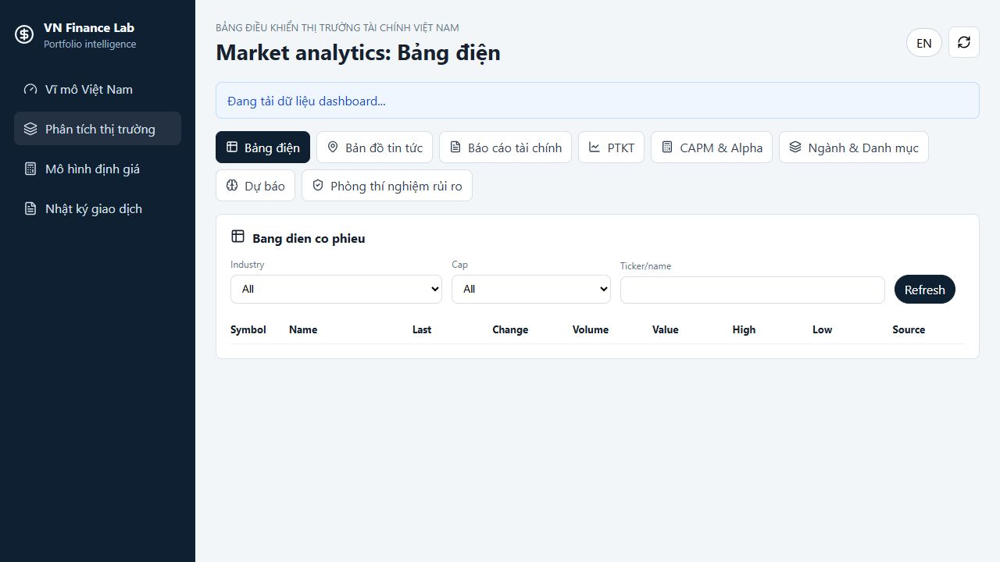
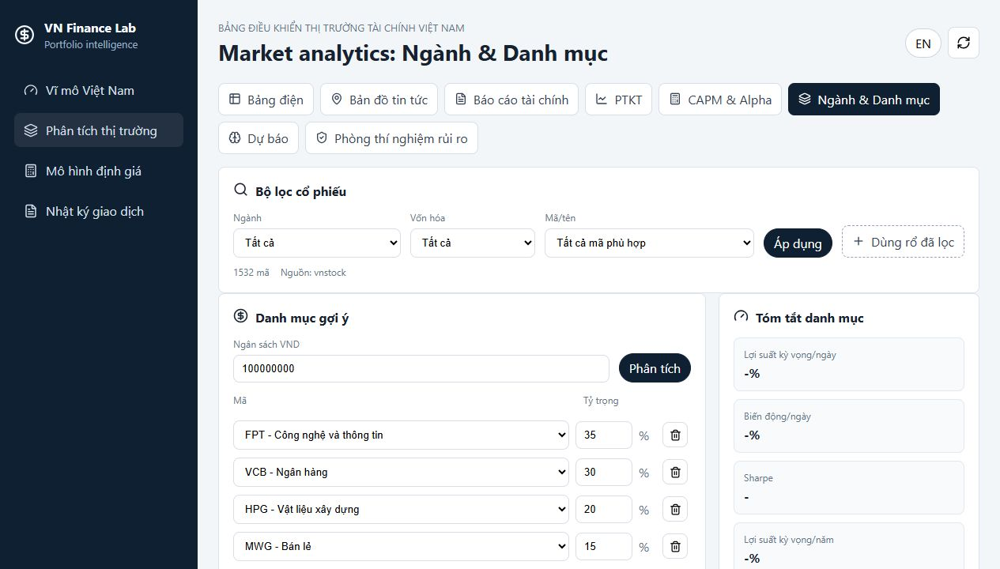
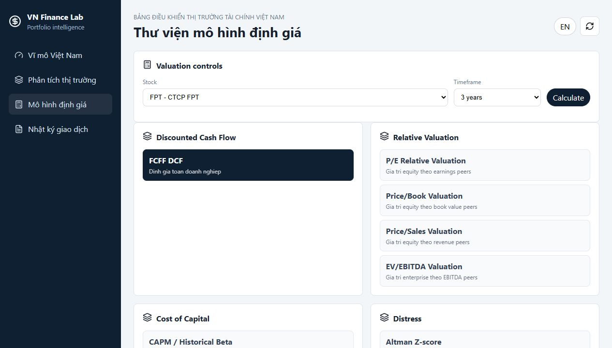
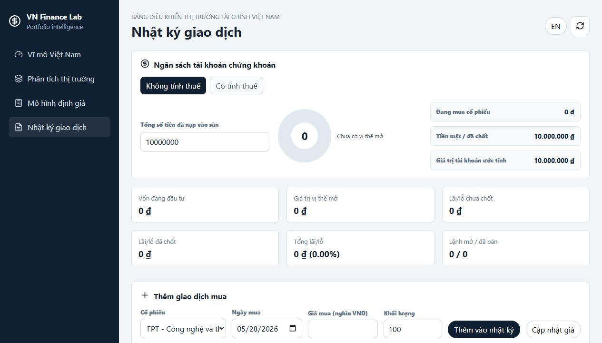

# Vietnam Financial Dashboard

Dashboard nghiên cứu tài chính và chứng khoán Việt Nam, tập trung vào dữ liệu vĩ mô, phân tích thị trường, định giá doanh nghiệp, quản trị rủi ro và nhật ký giao dịch.

> Repo này chỉ dùng để giới thiệu sản phẩm bằng README và hình ảnh màn hình. Source code backend/frontend, dữ liệu cá nhân, file cấu hình thật và mô hình nội bộ không nằm trong repo này.

## Tổng Quan

Màn hình vĩ mô tổng hợp các chỉ báo kinh tế, dòng tiền thị trường, dữ liệu nước ngoài, lãi suất và tín hiệu chu kỳ. Phần này giúp người dùng nhìn nhanh bối cảnh thị trường trước khi đi vào từng cổ phiếu hoặc danh mục.

## Phân Tích Thị Trường

Khu vực phân tích thị trường gom các công cụ chính như bảng điện, bản đồ tin tức, báo cáo tài chính, phân tích kỹ thuật, CAPM/Alpha, dự báo và phòng thí nghiệm rủi ro.

## Ngành Và Danh Mục

Màn hình ngành và danh mục cho phép lọc cổ phiếu theo ngành, vốn hóa và mã; tạo rổ cổ phiếu; phân bổ tỷ trọng; xem tóm tắt lợi suất, biến động, Sharpe, histogram lãi/lỗ, chu kỳ Fourier theo ngành, mô phỏng Markowitz và ma trận tương quan.

## Mô Hình Định Giá

Thư viện định giá hỗ trợ các nhóm mô hình như FCFF DCF, định giá tương đối theo P/E, P/B, P/S và các biến thể khác. Người dùng có thể chọn mã, khung thời gian, chỉnh đầu vào và đối chiếu nguồn dữ liệu.

## Nhật Ký Giao Dịch

Nhật ký giao dịch giúp ghi lại lệnh mua/bán, vốn, thuế/phí, trạng thái vị thế và hiệu quả đầu tư theo thời gian. Mục tiêu là biến quá trình đầu tư thành một vòng lặp có dữ liệu và có kỷ luật.

## Điểm Nổi Bật

- Dashboard song ngữ Việt/Anh, ưu tiên tiếng Việt có dấu.
- Dữ liệu thị trường và tài chính Việt Nam được gom vào một không gian phân tích thống nhất.
- Có mô hình dự báo, định giá, CAPM/Beta, Markowitz, VaR/CVaR, GARCH và các chỉ báo kỹ thuật.
- Có chế độ public/local riêng; source code thật được giữ trong repo private.
- Repo giới thiệu này không chứa khóa bí mật, dữ liệu cá nhân, file `.env`, backend API hoặc source code ứng dụng.

## Trạng Thái Bảo Mật

Source code đầy đủ của sản phẩm được lưu ở repo riêng tư. Repo này chỉ chứa:

- `README.md`
- Ảnh chụp màn hình trong thư mục `assets/`

Không có file chạy app, không có backend, không có database, không có dữ liệu giao dịch cá nhân và không có secret.
