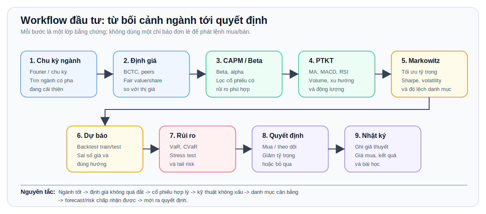

# Hướng Dẫn Workflow Đầu Tư Trên VN Finance Lab

Tài liệu này giải thích cách dùng dashboard theo một quy trình ra quyết định có cấu trúc. Mục tiêu không phải để một chỉ báo đơn lẻ “phát lệnh mua”, mà để gom nhiều lớp bằng chứng: chu kỳ ngành, cổ phiếu, kỹ thuật, danh mục, định giá, dự báo và rủi ro.

## Sơ Đồ Tổng Quan



Sơ đồ đi từ trái sang phải: tìm ngành có chu kỳ tốt, kiểm tra định giá, lọc cổ phiếu phù hợp bằng CAPM/beta, kiểm tra kỹ thuật, tối ưu danh mục, dự báo, đo rủi ro rồi mới ra quyết định.

Nên đi theo thứ tự này khi nghiên cứu một cổ phiếu:

```text
Ngành tốt -> định giá không quá đắt -> cổ phiếu có beta/return hợp lý -> PTKT không xấu -> danh mục không quá lệch -> forecast và risk chấp nhận được -> mới ra quyết định.
```

## 1. Chu Kỳ Ngành Từ Fourier

Mục đích: tìm ngành đang có pha chu kỳ tốt hơn, thay vì chọn cổ phiếu ngẫu nhiên.

Dashboard lấy dữ liệu giá các mã trong ngành, tính return, volatility và tách thành phần chu kỳ bằng Fourier/spectral analysis. Kết quả thường gồm:

- `expected_return_daily_pct`: lợi suất kỳ vọng ngày.
- `volatility_daily_pct`: biến động ngày.
- `dominant_period_days`: chu kỳ nổi bật, tính theo số phiên.
- `cycle_phase`: pha chu kỳ hiện tại.
- `points`: dữ liệu để vẽ đường chu kỳ.

Cách đọc:

- Ngành có return kỳ vọng dương, volatility không quá cao và pha chu kỳ đang cải thiện là ứng viên tốt.
- Chu kỳ Fourier là công cụ lọc bối cảnh, không phải tín hiệu mua trực tiếp.
- Nếu ngành tốt nhưng tin vĩ mô, xuất nhập khẩu hoặc dòng tiền xấu, cần hạ độ tin cậy.

## 2. Thư Viện Mô Hình Định Giá

Mục đích: kiểm tra giá trị hợp lý theo BCTC và peer, không chỉ dựa vào chart.

Nguồn dữ liệu:

- `vnstock Finance`: báo cáo tài chính năm.
- `vnstock Company.overview`: số cổ phiếu lưu hành, hồ sơ doanh nghiệp.
- `vnstock Trading.price_board`: giá hiện tại.
- `vnstock Quote.history`: lịch sử giá cho CAPM/beta.
- Link Vietstock để đối chiếu thủ công.

Relative valuation:

```text
P/E fair value = peer median P/E x EPS
P/B fair value = peer median P/B x book value/share
P/S fair value = peer median P/S x sales/share
EV/EBITDA fair value = (peer median EV/EBITDA x EBITDA - debt + cash) / shares
```

Đọc `Peers used`:

- Đây là số peer crawl được và qua bộ lọc hợp lệ, không phải tổng số peer tìm thấy.
- `Peer candidates scanned` cho biết hệ thống đã thử bao nhiêu mã cùng ngành.
- Nếu API bị giới hạn, dashboard nên chờ hoặc dùng cache; không nên lấy kết quả peer quá ít làm kết luận cuối.

Edit inputs:

- Có thể sửa các input numeric trong `Crawled inputs`.
- Sau khi apply, backend tính lại model với override của user.
- Nên dùng khi bạn đã đối chiếu BCTC và thấy số crawl sai hoặc đơn vị sai.

## 3. CAPM Và Beta

Mục đích: sau khi định giá không quá bất hợp lý, lọc cổ phiếu có quan hệ rủi ro/lợi suất hợp lý với thị trường.

Công thức chính:

```text
stock_return[t] = close[t] / close[t-1] - 1
beta = Cov(stock_return, market_return) / Var(market_return)
expected_return = risk_free + beta x (market_return - risk_free)
alpha = realized_return - expected_return
```

Cách đọc:

- `Beta > 1`: cổ phiếu nhạy hơn thị trường, lợi nhuận có thể cao hơn nhưng rủi ro cũng cao hơn.
- `Beta < 1`: biến động thấp hơn thị trường.
- `Alpha dương`: thực tế vượt lợi suất CAPM kỳ vọng trong giai đoạn đó.
- `Tracking error`: độ lệch so với benchmark; càng cao thì càng khó đoán theo index.

Dùng CAPM để so sánh các mã trong cùng ngành. Không nên lấy beta thấp/cao một cách máy móc; hãy nối với mục tiêu danh mục của bạn.

## 4. PTKT Tốt Theo Ngành

Mục đích: sau khi cổ phiếu qua lớp định giá và CAPM, kiểm tra trạng thái kỹ thuật trước khi đưa vào danh mục.

Hệ thống scan các mã trong ngành và xếp hạng theo:

- MA trend: giá nằm trên/dưới MA20, MA50, MA100, MA200.
- MACD: xu hướng động lượng.
- RSI: quá mua, quá bán, hoặc vùng tích cực.
- Volume: dòng tiền vào/ra so với trung bình.

Điểm tổng:

```text
Score = MA + MACD + RSI + Volume
```

Cách đọc:

- Điểm cao và recommendation `Buy/Accumulate` là ứng viên đáng theo dõi.
- Nếu score cao nhưng RSI quá mua, không nên đuổi giá; chờ pullback hoặc xác nhận.
- Nếu ngành tốt nhưng PTKT của phần lớn mã xấu, có thể chu kỳ ngành chưa vào pha hành động.

Lưu ý dữ liệu:

- Bảng PTKT ưu tiên lịch sử giá thật từ `vnstock Quote.history`.
- Hệ thống giữ cache kết quả tốt gần nhất để không mất bảng khi API tạm thời lỗi.
- Nếu nguồn lịch sử thật chưa có cho một mã, dashboard có thể dùng fallback có nhãn nguồn rõ ràng; không nên coi fallback như tín hiệu mua/bán chắc chắn.

## 5. Markowitz Và Tối Ưu Danh Mục

Mục đích: sau khi chọn một nhóm mã tốt, xem tỷ trọng nào hợp lý hơn thay vì all-in một mã.

Input:

- Danh sách holdings.
- Tổng vốn.
- Số lần mô phỏng.

Công thức nền tảng:

```text
portfolio_return = sum(weight_i x return_i)
portfolio_variance = w^T x covariance_matrix x w
Sharpe = expected_return / volatility
```

Cách đọc:

- `Max Sharpe`: danh mục có lợi suất/rủi ro tốt nhất trong mô phỏng.
- `Min volatility`: danh mục biến động thấp nhất.
- `Correlation heatmap`: cặp cổ phiếu nào đi cùng nhau quá mạnh.

Quy tắc thực hành:

- Không nên chỉ lấy danh mục Max Sharpe nếu tỷ trọng quá tập trung.
- Nếu các mã cùng ngành có correlation cao, rủi ro thực tế có thể lớn hơn cảm giác.
- Nên giới hạn tỷ trọng tối đa mỗi mã/ngành theo kỷ luật riêng.

## 6. Forecast / Dự Báo

Mục đích: kiểm tra model có học được hành vi giá gần đây không, và dự báo có hợp lý không.

Quy trình:

```text
Dữ liệu lịch sử -> train set -> test set -> tính sai số/hướng đúng -> forecast tương lai
```

Chỉ số cần đọc:

- `Đúng toàn test`: số phiên test model đoán đúng hướng.
- `Đúng trên tín hiệu`: độ chính xác trên các điểm model có tín hiệu.
- `Độ phủ`: số điểm model có dự báo / tổng điểm test.
- `RMSE`: căn bậc hai trung bình sai số bình phương, đơn vị giá thật.
- `MAE`: trung bình sai số tuyệt đối, đơn vị giá thật.

Cách dùng công bằng:

- So sánh model trên cùng train/test/horizon.
- Không so accuracy cao nếu coverage thấp mà không ghi chú.
- Nếu RMSE/MAE thấp nhưng sai hướng nhiều, model hợp với ước lượng giá hơn giao dịch.
- Nếu đúng hướng cao nhưng RMSE cao, model hợp với tín hiệu xu hướng hơn định giá mức giá.

## 7. Risk / Rủi Ro

Mục đích: trước khi mua, biết có thể mất bao nhiêu trong điều kiện xấu.

Chỉ số chính:

- Historical VaR: mức lỗ tối đa ước tính ở một mức tin cậy, dựa trên lịch sử.
- CVaR: nếu rơi vào nhóm ngày xấu nhất, mức lỗ trung bình là bao nhiêu.
- Monte Carlo VaR: mô phỏng phân phối lợi nhuận.
- Copula CVaR: rủi ro giảm đồng thời và phụ thuộc đuôi.

Cách đọc:

- VaR cho biết ngưỡng lỗ; CVaR cho biết khi vượt ngưỡng thì đau đến mức nào.
- Nếu CVaR quá lớn so với vốn chịu đựng, giảm tỷ trọng.
- Nếu danh mục có tail risk cao, không nên tăng margin.

## 8. Ra Quyết Định

Checklist thực tế:

```text
1. Ngành có pha chu kỳ tốt không?
2. Định giá có quá đắt không?
3. Cổ phiếu có beta/alpha phù hợp không?
4. PTKT có xác nhận xu hướng không?
5. Danh mục Markowitz có quá tập trung không?
6. Forecast có quá tệ trên test không?
7. VaR/CVaR có nằm trong mức chịu đựng không?
8. Tin tức, vĩ mô, dòng tiền nước ngoài có phủ định thesis không?
```

Kết luận gợi ý:

- `Mua`: khi ngành tốt, PTKT tốt, valuation không quá đắt, rủi ro chấp nhận được.
- `Theo dõi`: khi thesis tốt nhưng PTKT chưa xác nhận hoặc valuation hơi cao.
- `Giảm tỷ trọng`: khi rủi ro danh mục/tail risk cao, forecast xấu, hoặc PTKT gãy xu hướng.
- `Bỏ qua`: khi peer, valuation hoặc dữ liệu quá yếu, hoặc tin tức vĩ mô phủ định thesis.

## 9. Vận Hành Dashboard

Local:

```powershell
.\Start Local Dashboard.cmd
```

Public:

```powershell
.\Public Dashboard.cmd
```

Nếu PowerShell chặn script, hai file `.cmd` đã gọi với `ExecutionPolicy Bypass`. Nếu chạy tay:

```powershell
powershell -NoProfile -ExecutionPolicy Bypass -File .\scripts\dev.ps1
```

Nếu UI hiện kết quả cũ:

```text
Ctrl + F5
```

## 10. Nguyên Tắc Quan Trọng

- Không có model nào đảm bảo đúng 90% ổn định trên toàn thị trường.
- Kết quả model chỉ là bằng chứng định lượng, không thay thế kỷ luật đầu tư.
- Khi dữ liệu thiếu, nên hiện warning/cache/chờ lấy đủ, không vẽ đẹp giả.
- Mọi quyết định nên ghi vào journal để sau này xem lại thesis đúng hay sai.
