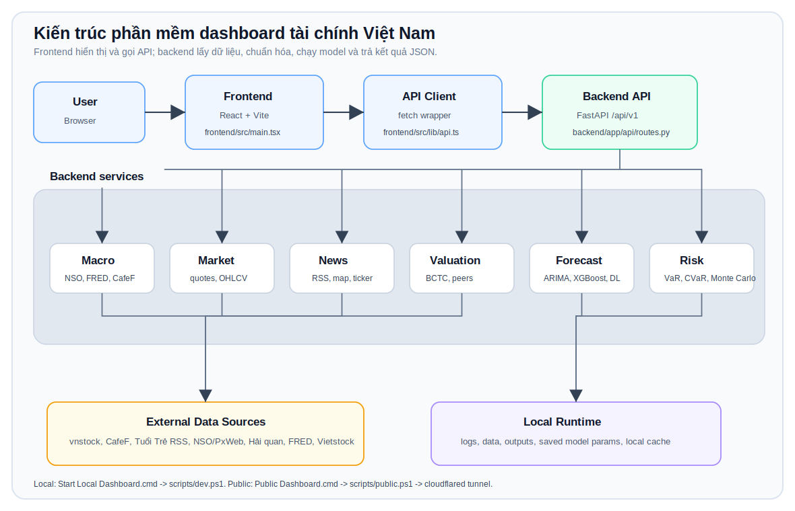

# Kiến Trúc Và Software Stack

Tài liệu này mô tả các lớp chính của dashboard tài chính Việt Nam: ứng dụng chạy bằng gì, dữ liệu đi qua đâu, thư viện nào đảm nhiệm phần nào, và khi cần sửa thì nên mở file nào trước.

Đọc file này khi bạn muốn hiểu hệ thống ở góc nhìn kỹ thuật. Đọc [dashboard_workflow_vi.md](dashboard_workflow_vi.md) khi bạn muốn hiểu quy trình đầu tư. Đọc [forecast_models_vi.md](forecast_models_vi.md) khi bạn muốn hiểu riêng các mô hình dự báo.

## 1. Bức Tranh Tổng Quan



Ý tưởng chính:

- Frontend chỉ hiển thị, nhận input và gọi API.
- Backend chịu trách nhiệm lấy dữ liệu, chuẩn hóa, tính toán, chạy model và trả JSON.
- Các nguồn dữ liệu bên ngoài có thể chậm hoặc thiếu, nên app cần cache, fallback và cảnh báo rõ nguồn.
- Local và public dùng cùng backend/source code; public chỉ khác ở bước build frontend và mở tunnel.

## 2. Các Lớp Trong Hệ Thống

| Lớp | Công nghệ | Trách nhiệm | File chính |
|---|---|---|---|
| UI | React, TypeScript, Vite | Màn hình, form, chart, tương tác user | `frontend/src/main.tsx` |
| Styling | CSS thuần | Layout, responsive, card, chart, toolbar | `frontend/src/styles.css` |
| API client | TypeScript fetch wrapper | Gọi backend, định nghĩa type response | `frontend/src/lib/api.ts` |
| Backend API | FastAPI, Uvicorn | Route `/api/v1`, validation, response schemas | `backend/app/api/routes.py` |
| Schemas | Pydantic | Hợp đồng dữ liệu giữa backend và frontend | `backend/app/schemas/analytics.py` |
| Services | Python | Macro, news, valuation, forecast, risk, market logic | `backend/app/services/*` |
| Scripts | PowerShell, CMD | Setup, chạy local, build public tunnel | `scripts/*.ps1`, `*.cmd` |

## 3. Runtime Và Cách Chạy

### Local Mode

```text
Start Local Dashboard.cmd
  -> scripts/dev.ps1
     -> backend: uvicorn app.main:app --port 8001
     -> frontend: vite --port 5173
```

URL:

```text
Frontend: http://127.0.0.1:5173/
Backend:  http://127.0.0.1:8001/api/v1
Health:   http://127.0.0.1:8001/api/v1/health
```

Đặc điểm:

- Phù hợp để phát triển và test nhanh.
- Frontend dùng Vite dev server, thường tự reload khi sửa code.
- Nếu trình duyệt vẫn giữ UI cũ, nhấn `Ctrl + F5`.

### Public Mode

```text
Public Dashboard.cmd
  -> scripts/public.ps1
     -> npm run build
     -> backend: uvicorn app.main:app --port 8001
     -> share-server: http://127.0.0.1:8787
     -> cloudflared tunnel
```

Đặc điểm:

- Dùng để chia sẻ dashboard qua link `https://*.trycloudflare.com`.
- Mỗi lần sửa frontend nên chạy lại public script để build bản mới.
- Backend vẫn là cùng code local, chỉ khác cách expose ra ngoài.

## 4. Frontend Stack

| Thư viện | Vai trò |
|---|---|
| `react`, `react-dom` | Dựng UI |
| `vite` | Dev server và build frontend |
| `typescript` | Type checking |
| `recharts` | Vẽ line chart, bar chart, pie chart, scatter chart |
| `lucide-react` | Icon trong nút, card, toolbar |

Luồng frontend:

```text
main.tsx
  -> user chọn tab/module
  -> gọi hàm trong api.ts
  -> nhận JSON từ backend
  -> render card/chart/table
```

Các tab cấp cao trong app:

```text
Vĩ mô Việt Nam
Phân tích thị trường
Mô hình định giá
Nhật ký giao dịch
```

Các tab con trong `Phân tích thị trường`:

```text
Bảng điện
Bản đồ tin tức
Báo cáo tài chính
PTKT
CAPM & Alpha
Ngành & Danh mục
Dự báo
Phòng thí nghiệm rủi ro
```

## 5. Backend Stack

| Thư viện | Vai trò |
|---|---|
| `fastapi` | API framework |
| `uvicorn` | ASGI server |
| `pydantic` | Schema request/response |
| `requests`, `httpx` | Gọi nguồn dữ liệu ngoài |
| `pandas`, `numpy` | Xử lý bảng, chuỗi thời gian, feature |
| `scipy` | Thống kê và tối ưu |
| `pypdf` | Đọc PDF Hải quan |
| `feedparser` | Đọc RSS tin tức |
| `vnstock` | Dữ liệu chứng khoán Việt Nam |
| `yfinance` | Nguồn thị trường phụ khi cần |

Cấu trúc backend chính:

```text
backend/app
|-- main.py
|-- api
|   `-- routes.py
|-- schemas
|   `-- analytics.py
`-- services
    |-- macro.py
    |-- news.py
    |-- valuation.py
    |-- forecast.py
    `-- ...
```

## 6. Data Sources

| Nguồn | Dữ liệu dùng trong app | Ghi chú |
|---|---|---|
| `vnstock` | Giá, OHLCV, hồ sơ công ty, BCTC, shares outstanding | Nguồn chính cho chứng khoán Việt Nam |
| CafeF | Dòng tiền nước ngoài, RSS tin tức | Có thể thay đổi endpoint/schema |
| Tuổi Trẻ RSS | Tin kinh tế/chính sách | Dùng cho bản đồ tin tức |
| NSO/PxWeb | GDP, CPI, XNK, nhóm hàng chính | Dữ liệu vĩ mô theo tháng/quý/năm |
| Tổng cục Hải quan | Báo cáo XNK theo tháng | App đọc PDF và gom nhóm ngành |
| FRED T10Y3M | 10Y-3M yield spread Mỹ | Dùng nhận định rủi ro suy thoái |
| FRED CSV mirror | Dữ liệu phụ cho T10Y3M | Dùng khi FRED chính timeout |
| Vietstock | Link đối chiếu thủ công | Không nên coi là nguồn tính tự động nếu chưa crawl |

Nguyên tắc dữ liệu:

- Hiển thị nguồn dữ liệu cạnh kết quả.
- Khi nguồn thiếu hoặc lỗi, ưu tiên warning/cache/fallback có nhãn.
- Không vẽ kết quả “đẹp” nếu dữ liệu thực chưa đủ.
- Các nguồn macro/XNK không phải realtime; có cache theo giờ hoặc theo chu kỳ công bố.

## 7. Phân Tích, Forecast Và Risk

### Forecast / Machine Learning

File chính:

```text
backend/app/services/forecast.py
```

Thư viện/model:

| Nhóm | Công cụ | Dùng cho |
|---|---|---|
| Statistical | `statsmodels`, `statsforecast` | ARIMA, AutoARIMA |
| Machine learning | `xgboost`, `scikit-learn` | XGBoost, classifiers, feature scaling |
| Deep learning | `torch`, `neuralforecast` | LSTM, GRU, Transformer, TimesNet, N-BEATS, N-HiTS... |
| Research/tuning | `optuna`, grid/range search trong code | Tìm tham số tốt theo cổ phiếu/model |

Tài liệu riêng:

- [forecast_models_vi.md](forecast_models_vi.md)

### Portfolio Và Risk

| Công cụ | Dùng cho |
|---|---|
| `PyPortfolioOpt` | Markowitz, tối ưu tỷ trọng |
| `scipy` | Tối ưu và thống kê |
| `arch` | Volatility/GARCH khi mở rộng |
| `copulas` | Phụ thuộc đuôi, downside cùng lúc |
| `quantstats`, `empyrical` | Metrics tài chính/backtest khi mở rộng |

Phần app liên quan:

- `Ngành & Danh mục`: chu kỳ ngành, universe, Markowitz.
- `Phòng thí nghiệm rủi ro`: VaR, CVaR, stress test, Monte Carlo, risk contribution.

## 8. Valuation

File liên quan:

```text
backend/app/services/valuation.py
frontend/src/main.tsx
```

Các nhóm model:

- DCF / FCFF / FCFE.
- Relative valuation: P/E, P/B, P/S, EV/EBITDA.
- Excess return.
- EVA.
- Altman Z-score.

Dữ liệu đầu vào:

- Giá thị trường.
- Shares outstanding.
- Net income.
- Book value.
- Revenue/sales.
- EBITDA/debt/cash nếu có.
- Peer set cùng ngành.

Điểm cần nhớ:

- `Peers used` là số peer hợp lệ sau khi crawl/filter, không phải tổng số mã cùng ngành.
- `Edit inputs` cho phép sửa số crawl trước khi tính lại.
- Kết quả định giá phụ thuộc mạnh vào chất lượng BCTC, đơn vị dữ liệu và peer set.

## 9. File Nên Mở Khi Muốn Sửa

| Muốn sửa | Mở file |
|---|---|
| Text, layout, card, chart, tab UI | `frontend/src/main.tsx` |
| CSS, responsive, spacing, màu | `frontend/src/styles.css` |
| API call từ frontend | `frontend/src/lib/api.ts` |
| Route backend | `backend/app/api/routes.py` |
| Schema response/request | `backend/app/schemas/analytics.py` |
| Vĩ mô, FRED, NSO, Hải quan, CafeF foreign flow | `backend/app/services/macro.py` |
| Tin tức, vùng, ticker, RSS | `backend/app/services/news.py` |
| Forecast, research, model params | `backend/app/services/forecast.py` |
| Định giá, peers, financial inputs | `backend/app/services/valuation.py` |
| Chạy local/public | `scripts/dev.ps1`, `scripts/public.ps1` |
| Setup môi trường | `scripts/setup.ps1` |

## 10. Kiểm Tra Sau Khi Sửa

Backend:

```powershell
.\.venv\Scripts\python.exe -m compileall backend\app
```

Frontend:

```powershell
cd frontend
npm.cmd run build
```

Restart local:

```powershell
powershell -NoProfile -ExecutionPolicy Bypass -File .\scripts\dev.ps1
```

Health check:

```text
http://127.0.0.1:8001/api/v1/health
```

Nếu UI còn cũ:

```text
Ctrl + F5
```

## 11. Tài Liệu Liên Quan

- [README.md](../README.md): tổng quan project và cách chạy.
- [dashboard_workflow_vi.md](dashboard_workflow_vi.md): quy trình đầu tư từ ngành tới quyết định.
- [forecast_models_vi.md](forecast_models_vi.md): giải thích từng model dự báo.
- [../ACTION.md](../ACTION.md): roadmap/system plan.
- [../MONITORING.md](../MONITORING.md): monitoring, data quality, model drift và runbook.
